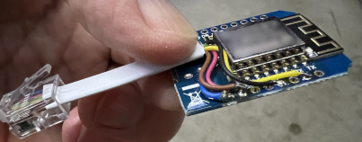
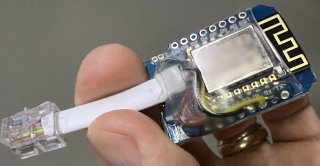
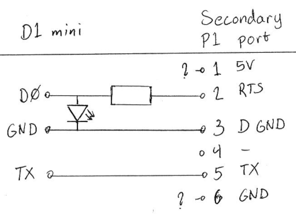
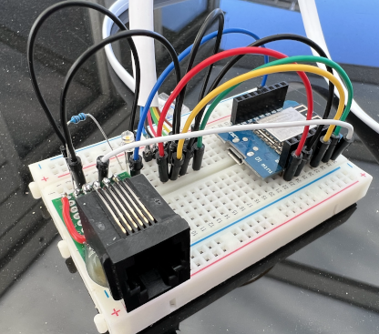

# esphome-p1mini
Based on esphome-p1reader, which is an ESPHome custom component for reading P1 data from electricity meters. Designed for Swedish meters that implements the specification defined in the [Swedish Energy Industry Recommendation For Customer Interfaces](https://www.energiforetagen.se/forlag/elnat/branschrekommendation-for-lokalt-kundgranssnitt-for-elmatare/) version 1.3 and above.

Notable differences from esphome-p1reader are:
* More frequent update of sensors with configurable update period (if supported by meter).
* No additional components needed. RJ12 cable connects directly to D1Mini (or equivalent)
* Code rewritten to not spend excessive amounts of time in calls to the `loop` function. This should ensure stable operation of ESPHome and might help prevent some serial communication issues.
* Now (Sep 2022) also supports the binary format used by some meters.

## ESPHome version
The current version is tested with ESPHome version `2023.5.5`. Make sure your ESPHome version is up to date if you experience compile problems.

## Verified meter hardware / supplier
* [Sagemcom T211](https://www.ellevio.se/globalassets/content/el/elmatare-produktblad-b2c/ellevio_produktblad_fas3_t211_web2.pdf) / Ellevio, Skånska Energi
* [Aidon 6534](https://jonkopingenergi.se/storage/B9A468B538E9CF48DF5E276BDA7D2D12727D152110286963E9D603D67B849242/5009da534dbc44b6a34cb0bed31cfd5c/pdf/media/b53a4057862646cbb22702a847a291a2/Aidon%206534%20bruksansvisning.pdf) with RJ12/P1-port module (*not* RJ45/NVE module) / SEVAB
* [Landis+Gyr E360](https://eu.landisgyr.com/blog-se/e360-en-smart-matare-som-optimerarden-totala-agandekostnaden) / E.ON
* [S34U18 (Sanxing SX631)](https://www.vattenfalleldistribution.se/matarbyte/nya-elmataren/) / Vattenfall - [But read this](NO-RTS.md)
* Kamstrup OMNIPOWER

## Meters verified with esphome-p1reader, which should work too...
* [Itron A300](https://boraselnat.se/elnat/elmatarbyte-2020-2021/sa-har-fungerar-din-nya-elmatare/) / Borås Elnät
* [KAIFA MA304H4E](https://reko.nackaenergi.se/elmatarbyte/) / Nacka Energi
* [KAIFA CL109](https://www.oresundskraft.se/dags-for-matarbyte/) / Öresundskraft

## Hardware
I have used a D1 mini clone, but most ESP-based controllers should work as long as you figure out appropriate pins to use. The P1 port on the meter provides 5V up to 250mA which makes it possible to power the circuit directly from the P1 port.

ESP32 based boards draw more power, which may cause a problem with the supply from the meter and generally offer no advantage over ESP8266 based boards.

If you have pre built hardware which does not connect the RTS signal to a GPIO, [read this](NO-RTS.md).

### Parts
- 1 (Wemos) D1 mini or clone.
- 1 RJ12 cable (6 wires)
- Optionally, hot melt glue and large heat shrink tubing.

### Wiring D1Mini
Wiring is simple. Five of the pins from the connector (one pin is not used)...


... are connected to four of the pads on the D1Mini.


And that is it. The result could look something like this:



Some hot-melt glue and heat shrink tubing will make it more robust though.



## P1 Passthrough
It is possible to attach another P1 reading device in case you need to connect a car charger (or a second p1-mini...) etc. If you have no need for this, you can skip this section and continue with "Installation" below.

### Parts
- Female connector for the RJ12 cable.
- White (or blue) LED
- Resistor 1 - 3 kΩ



The LED will, in addition to providing visual indication that updates are beeing requested on the port, ensure that the voltage on D0 will not get high enough to damage the D1mini. The LED needs to have a high enough voltage drop for it to work and some colors may not work.

The value of the resistor is not very critical. I have tested with 3 kΩ and anything down to 1 kΩ should be fine.

A p1mini wired up with a secondary port (unpowered) on an experimental board:



### Power to the secondary port

Power to the secondary port needs to be supplied from a secondary source (Like an USB charger). Unless the secondary device is already powered (like a car charger etc) in which case it may not be necessary to supply any power at all to the secondary port.

### Limitations

Updates are only sent to the secondary port right after they have been received and processed (if the secondary device is requesting updates via the RTS signal). That means that if the d1mini is set to only update every 15 seconds, the secondary device can not get updates more frequently than that.

## Installation
Clone the repository and create a companion `secrets.yaml` file with the following fields:
```
wifi_ssid: <your wifi SSID>
wifi_password: <your wifi password>
p1mini_password: <Your p1mini password (for OTA, etc)>
p1mini_api_key: <Home Assistant API key>
```
Make sure to place the `secrets.yaml` file in the root path of the cloned project. The `p1mini_password` field can be set to any password before doing the initial upload of the firmware.

Flash ESPHome as usual, just keep the `p1mini.h` file in the same location as `p1mini.yaml` (and `secrets.yaml`). *Don't* connect USB and the P1 port at the same time! If everything works, Home Assistant will autodetect the new integration after you plug it into the P1 port.

If you do not receive any data, make sure that the P1 port is enabled on your meter and try setting the log level to `DEBUG` in ESPHome for more feedback.

## Technical documentation
Specification overview:
https://www.tekniskaverken.se/siteassets/tekniska-verken/elnat/aidonfd-rj12-han-interface-se-v13a.cleaned.pdf

OBIS codes:
https://tech.enectiva.cz/en/installation-instructions/others/obis-codes-meaning/

P1 hardware info (in Dutch):
http://domoticx.com/p1-poort-slimme-meter-hardware/
